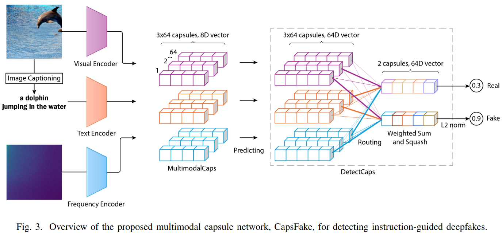
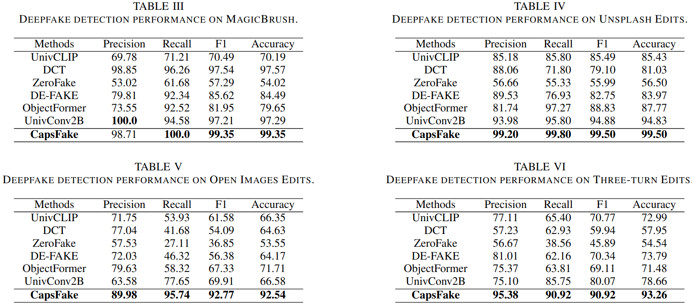

# CapsFake: A Multimodal Capsule Network for Detecting Instruction-Guided Deepfakes



In this paper, we propose a novel multimodal capsule network designed to address the detection of deepfake image editing. Specifically, low-level capsules from multiple modalities are integrated to predict capsules in subsequent layers. High-level capsules compete to select relevant low-level capsules, effectively aggregating local features to detect manipulated entities. The proposed approach is evaluated on diverse datasets, including natural images from real-world scenarios. Experimental results demonstrate that our model significantly outperforms state-of-the-art methods, achieving a substantial 10% improvement in Three-turn Edits or 20% improvement in Open Images Edits. Ablation studies further validate the robustness of the network, achieving detection rates exceeding 94% against natural perturbations and over 96% against adversarial perturbations. Additionally, the model effectively adapts to unseen image editing datasets, highlighting its ability to generalize across diverse and previously unencountered editing scenarios.

## Results
### Evaluation results on various Datasets


We compare the performance of our proposed method, CapsFake, with state-of-the-art deepfake detection models: UnivCLIP, DCT, ZeroFake, DE-FAKE, ObjectFormer and UnivConv2B. The evaluation metrics include precision, recall, F1 score, and accuracy. We evaluate these methods on datasets of increasing difficulty, ranging from single-turn edits, including MagicBrush, Unsplash Edits, and Open Images Edits, to Multi-turn Edits involving multiple rounds of editing.

### Routing Process Visualization


In Figure a, the prediction vectors \(\hat{\textbf{u}}_{j|i}\) are color-coded by modality: image (purple), text (orange), and frequency (cyan). Figures b, c, and d illustrate the progression of the routing process within the DetectCaps layer. For detection, we use three iterations of routing, which have been found to be effective. The visualization shows how real (blue) and manipulated (red) capsules \(\textbf{v}_j\) combine information from different modalities to identify deepfake patterns.

## Dataset

Download the dataset from Google Drive:  
[**CapsFake_dataset Link**](https://drive.google.com/drive/folders/1isLI6wTM-p171e0ZmXDC8BpRnOjCD-H-?usp=sharing)

## Installation and Usage

### Environment Setup

Create and activate conda environment:
```bash
conda env create -f environment.yaml
conda activate CapsFake
```

### Train

```bash
python main_CapsFake.py --save_dir "./checkpoints" --image_root "/path/to/dataset"
```

### Test

```bash
python Evl_CapsFake.py --load_model "./checkpoints/best_model.pth" --image_root "/path/to/test_dataset"
```

### 📚 BibTeX

```bibtex
@article{nguyen2025capsfake,
  title={CapsFake: A Multimodal Capsule Network for Detecting Instruction-Guided Deepfakes},
  author={Nguyen, Tuan and Khan, Naseem and Khalil, Issa},
  journal={arXiv preprint arXiv:2504.19212},
  year={2025}
}
```
